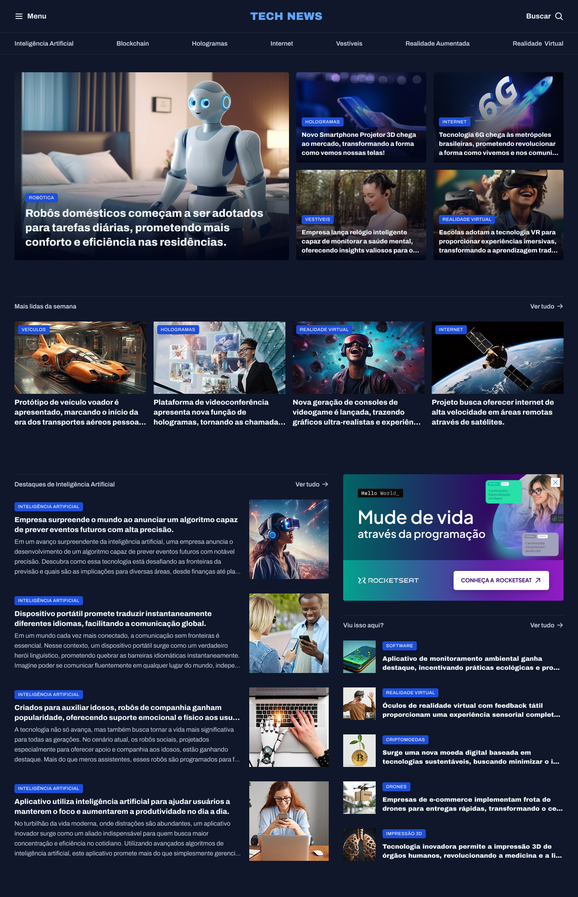

# 📰 Portal de Notícias – TechNews

Este projeto é uma página web responsiva que simula um **portal de notícias de tecnologia**.
O layout apresenta destaques, seções temáticas, notícias mais lidas, artigos sobre **Inteligência Artificial** e sugestões adicionais, em um design moderno inspirado em revistas digitais.

---

## 📂 Estrutura do Projeto

```
.
├── index.html         # Estrutura principal da página
├── styles/            # Pasta com arquivos de estilo
│   ├── index.css      # Importa os demais estilos
│   ├── global.css     # Variáveis, resets e estilos globais
│   ├── header.css     # Estilização do cabeçalho e menus
│   ├── utility.css    # Classes utilitárias (grid, gaps, tipografia)
│   └── sections.css   # Estilos específicos de seções (não exibido aqui)
└── assets/            # Recursos visuais
    ├── Logo.svg
    ├── Ads.png
    ├── icons/         # Ícones usados no layout
    │   ├── List.svg
    │   ├── MagnifyingGlass.svg
    │   └── outros...
    └── images/        # Imagens ilustrativas das matérias
        ├── Image 01.png
        ├── Image 02.png
        ├── ... até Image 18.png
```

---

## ✨ Funcionalidades

* 📰 **Destaques em evidência** logo no topo (notícia principal + grid de destaques).
* 📊 **Seção “Mais lidas da semana”** com notícias populares.
* 🤖 **Seção de Inteligência Artificial** com artigos em destaque.
* 📢 **Espaço para anúncios** (banner lateral).
* ➕ **Sugestões adicionais** em “Viu isso aqui?”.
* 🎨 **Design responsivo e moderno**, baseado em **CSS Grid**.
* 📱 **Tipografia adaptada** com variáveis CSS e Google Fonts (*Archivo*).

---

## 🖥️ Tecnologias Utilizadas

* **HTML5** – Estrutura semântica.
* **CSS3** – Layout com **CSS Grid**, variáveis e classes utilitárias.
* **Google Fonts** – Fonte *Archivo*.

---

## 🚀 Como Executar

1. **Clonar o repositório**

   ```bash
   git clone https://github.com/joaovictorsalotialves/portal-technews.git
   ```

2. **Acessar a pasta do projeto**

   ```bash
   cd portal-technews
   ```

3. **Abrir no navegador**

   * Clique duas vezes no arquivo `index.html`
   * Ou utilize a extensão **Live Server** no VSCode para rodar localmente.

---

## 📸 Prévia do Projeto



---

## 📄 Licença

Este projeto foi desenvolvido para fins educacionais e pode ser utilizado livremente.
